# CMSC733 Homework 0 - Alohamora 
## Department of Computer Science- University of Maryland, College Park

Assignment page can be found [here.](https://cmsc733.github.io/2022/hw/hw0/)

Report : report.pdf

## Phase 1: Shake My Boundary

#### Introduction

This involves developing the simplified pb algorithm, which helps find edges in images by looking at brightness, color, and texture across different scales. The algorithm gives a probability for each pixel showing if it's likely to be an edge. 

#### Overview of the algorithm :

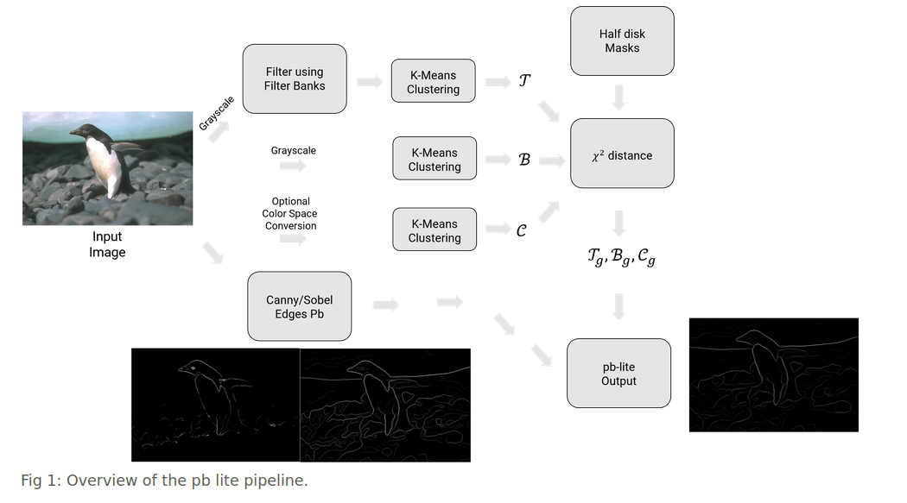

For more info on how it is built, check out report.pdf.

--> All the code files for Phase1 and Phase2 are executed on Google colab.
   
   Phase 1 - Phase1/Code/phase1.ipynb
   
   Phase 2 - Phase2/Code/phase2.ipynb
#### Filter banks 

#### Oriented Derivative of Gaussian Filters:
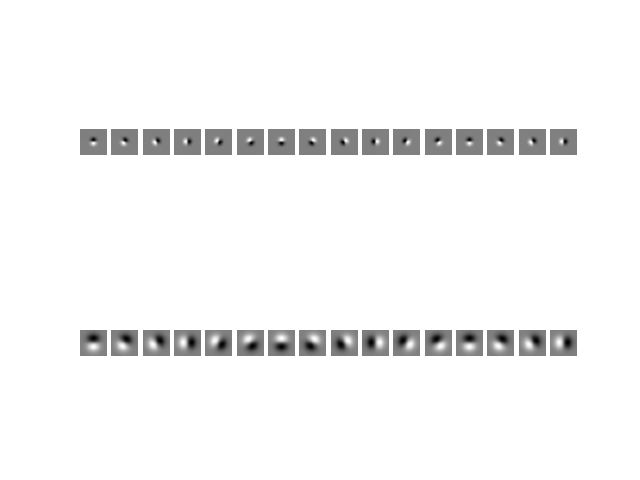

#### Leung-Malik Filters:
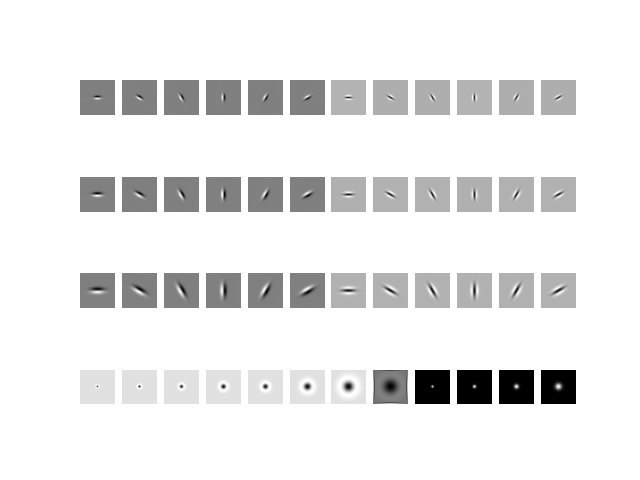

#### Gabor Filters:
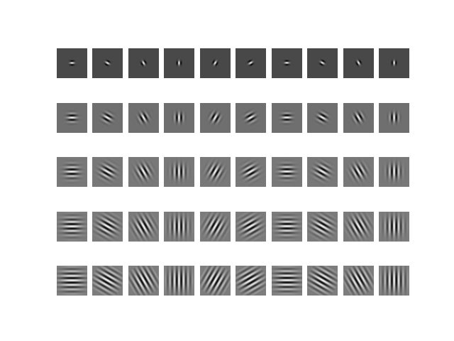

#### Texton Map:

This can be found in the folder Phase1/Outputs/texton maps/

K-Means Clustering with k=100

#### Color Maps : 

This can be found in the folder Phase1/Outputs/color maps/

Red, green, blue channel filtering :

K-Means clustering with k=16

#### Brightness Maps : 

This can be found in the folder Phase1/Outputs/brightness maps/

K-Means clustering with k=16

Red, green, blue channel filtering :

#### Half disc masks to generate gradients :

This can be found in the folder Phase1/Outputs/filter_banks/halfdisks.png

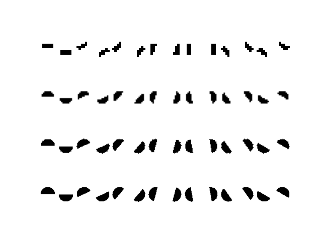

#### PB LITE

This can be found in the folder Phase1/Outputs/pblite/

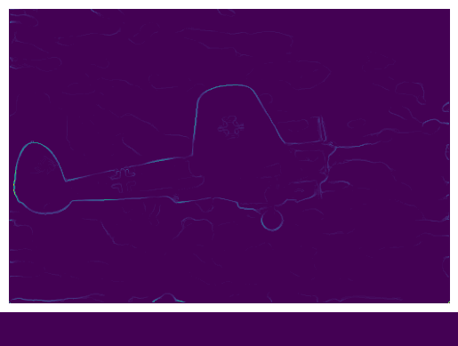

### Comparison with Canny and Sobel baselines : 

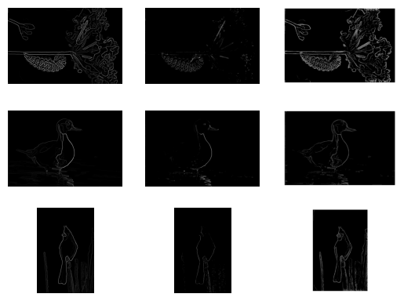
*Canny baseline(left), Sobel(middle), pblite(right)*

## Phase 2: Deep dive on Deep Learning

This involves implementing multiple neural network architectures and comparing them on various criterion like number of parameters, train and test set accuracies and provide detailed analysis of why one architecture works better than another one.

Dataset : CIFAR10

### Basic Neural Network : (3 - layer Conv net)

#### Architecture :
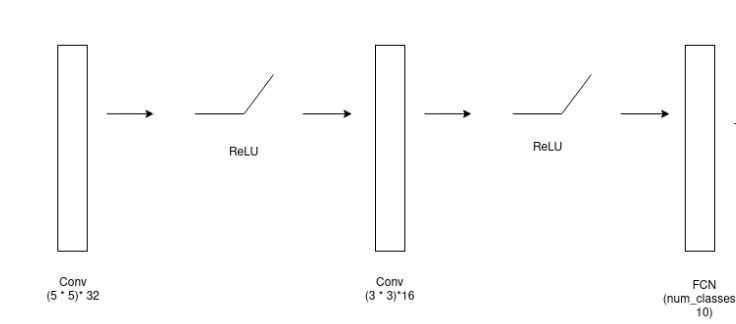

#### Training Loss and Accuracy curves :
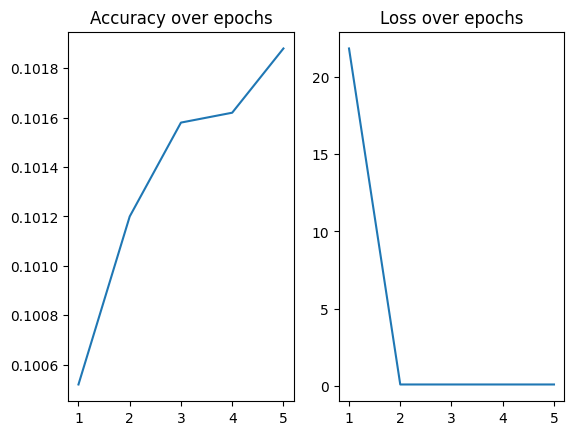

#### Confusion Matrix :
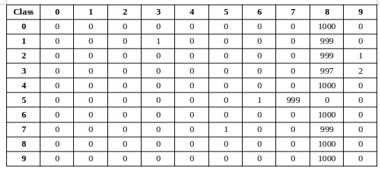

### RESNET 18 :

#### Architecture :
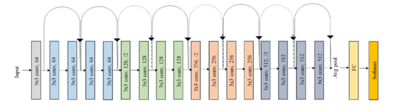

#### Training Loss and Accuracy curves :
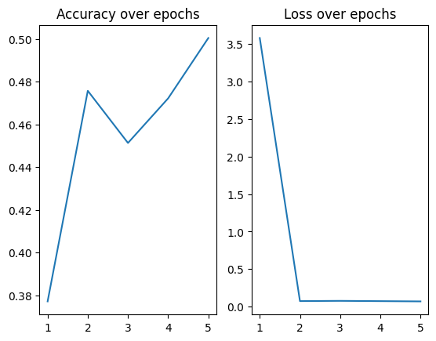

#### Confusion Matrix :
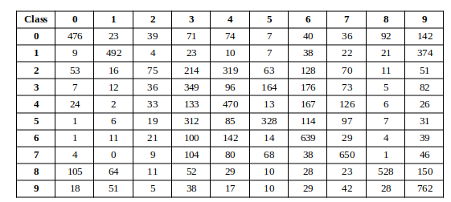

--> All the required folders and code files are in Code directory in both the phases

--> Paths are given in .ipynb files according to the author's drive structure. These paths need to be
   changed everywhere accordingly. 

--> Outputs and plots for both the phases can be seen in Code/Outputs. The cells in .ipynb files are
    executed and the outputs can be seen as cell outputs.

--> Phase 2 runs on Tensorflow 1, but due to limitations of tf1 usage on Google Colab,
    the starter code has been modified accordingly. This needs to be changed accordingly for
    different versions of Tensorflow.
    
--> Cifar10 data was not zipped in this submission. Please download the images from homework page
    and link it to the .ipynb file to run the code.
